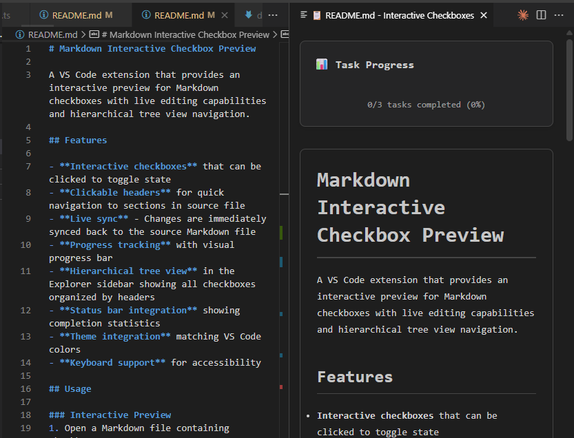

# Markdown Interactive Checkbox Preview

A VS Code extension that provides an interactive preview for Markdown checkboxes with live editing capabilities and hierarchical tree view navigation.



## Features

- **Interactive checkboxes** that can be clicked to toggle state
- **Live sync** - Changes are immediately synced back to the source Markdown file  
- **Progress tracking** with visual progress bar and hover over support
- **Hierarchical tree view** in the Explorer sidebar showing all checkboxes organized by headers
- **Status bar integration** showing completion statistics
- **Hover information** - Hover over checkboxes to see status, content, and quick toggle actions
- **CodeLens integration** - See toggle buttons directly above checkbox lines in the editor
- **Smart navigation** - Click headers in preview or tree to jump to source locations


## Usage

### Interactive Preview
1. Open a Markdown file containing checkboxes
2. Use Command Palette: "Open Interactive Checkbox Preview"

   

3. Click checkboxes in the preview to toggle them
4. **Click any header to navigate to that section in the source file**
5. Changes are automatically saved to your file

   

### Tree View Navigation

1. Open a Markdown file with checkboxes
2. Look for "Markdown Checkboxes" section in the Explorer sidebar
3. Browse your tasks organized by headers and hierarchy
4. Click any checkbox in the tree to toggle its state

   

5. Use the refresh button to update the tree view
6. **Toggle Headers visibility** using the eye icon to show/hide headers in the tree view for focused task management

### Hover & CodeLens Support

1. **Hover over checkboxes** in the editor to see:
   - Current status (checked/unchecked)
   - Task content
   - Quick toggle action
   - Position and formatting information

2. **CodeLens actions** appear above checkbox lines showing:
   - Toggle buttons with visual icons
   - One-click checkbox state changes
   - Seamless integration with VS Code's editor

## Supported Syntax

- [x] Unchecked task
- [ ] Checked task
  - [ ] Nested subtask
  
```markdown
# Header 1
## Header 2
### Header 3

- [ ] Unchecked task
- [ ] Checked task
  - [ ] Nested subtask
  - [x] Completed subtask
    - [x] Deeply nested task
```

## Installation

Install from the VS Code Extension Marketplace or use the .vsix file.

## Requirements

VS Code 1.84.0 or higher

## v1.0.1

- **Clickable Headers**: Click any header in the preview to jump to that section in the source editor
- **Enhanced Navigation**: Seamless navigation between preview and source with visual feedback
- **Improved User Experience**: Headers show hover effects and tooltips for better discoverability

## v1.0.0

- **Hierarchical Tree View**: Navigate all checkboxes in the Explorer sidebar
- **Status Bar Integration**: See completion stats at a glance
- **Nested Checkbox Support**: Handle indented/nested task lists
- **Header Organization**: Tasks grouped under their respective headers
